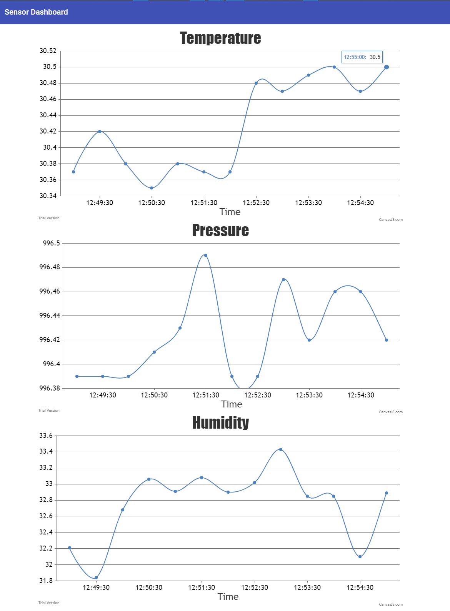

# Mensuring api parameters

## Abstract
The basic assumption for the project was to information the residents about the current air condition in the room. The information should include three parameters:
- temperature
- humidity
- pressure
The values are collected and can be displayed by User Interface in real time. There is also a API which can be use to fetch information in JSON format.

## Technologies
- Rasperry PI
- Python
- NodeJS
- MongoDB
- Angular
- Bootstrap

# Requirements
- Programable board Raspberry PI 3 
- Raspberry Sense HAT
- Docker
- docker-compose

## Description
System consists of four components: 
- sensor collect air air parameters, 
- database keeps all measurements, 
- API which handle endpoints and save data to DB, 
- GUI display information to the user.

Comunication between components works throught http interface. It means that every component can be in difference localization and data are send wireless.
On scheme below we can see these four component. On the left we can see a sensor which is build in Raspberry PI with Sense HAT extenssion. On this programmable board is installed program written in Python which deliver air parameters to API. API gets requests from sensor and write information to MongoDB instance. API is written in NodeJS. On the right hand you can see GUI, written in Angular, Which pull data from API and display them to the Users.




## Installation
By default you have to install three components API sensor and GUI. You don't have to install database because it comes with API.

### Install API and database
You can install this two commponents in every machines with installed Docker and docker-compose. Obviously machinnes has to have internet access. To install API and BD just get the project from repo. Do it by clone it or [download it as a zip](https://github.com/Bartosz95/measuring-air-parameters/archive/refs/heads/master.zip) and unpack it.
```
git clone https://github.com/Bartosz95/measuring-air-parameters.git
```
Next enter to this project directory/api and run.
```
docker-compose up
```
It gets you access to the API on API URL=http://localhost:3000/api/v1/. If you want to you can set access to your localhost instance outside. If you want to you can set static IP in this machine and configure your router to forward traffic to this host.

### Install sensor
For installation you have to manually install sensor application on your Raspberry board. First firstly connect extension to board.
Below to you have command which install library for handle this Sense HAT.
```
pip install sense-hat request
```
Then you have to pull project from repository. Please clone this project or [download zip](https://github.com/Bartosz95/measuring-air-parameters/archive/refs/heads/master.zip) and unpack it.
```
git clone https://github.com/Bartosz95/measuring-air-parameters.git
```
Enter to project directory and next to sensor directory. Now you have to set permissions for installation script. Just execute command below.
```
sudo chmod +x installation.sh
```
Now you have run installation script with URL address where is API. The command create a service in machine and start sending POST request to given API URL address.
```
sudo ./installation.sh <<API_URL>>
```
If you install sensor on the same machine like API use http://localhost:3000 instead of <<API_URL>>.

### Install GUI
To install GUI clone this project or [download zip](https://github.com/Bartosz95/measuring-air-parameters/archive/refs/heads/master.zip) and unpack it.
```
git clone https://github.com/Bartosz95/measuring-air-parameters.git
```
Then enter to gui directory and adapt <<API_URL>> parameter in nginx.conf. Similar like in sensor change <<API_URL>> with http://localhost:3000 if you run GUI and API on the same machine. 

```
    server {
        listen 80;
        root /usr/share/nginx/html;
        index index.html;

        location /api/v1/ {
            proxy_pass  <<API_URL>>/api/vi/ ;
        }
    }
```

Then run

```
docker-compose up
```

## Tutorial

### GUI
Go to http://localhost/ to open the GUI then you will see page like below. There are three graphs. The Temperature, Pressure and Humidity. New values will appers every 30 secounds. Max avaiables values on one graph is 30.


### API

You can run POST request like below.
```
curl -XPOST -H "Content-Type: application/json" {"date": “13/01/2021”, "time": “22:30:30”,"temperature": 23.5, "humidity": 51.3, "pressure": 1124.1} http://localhost:3000/api/v1
```
And pull information by GET requests. 
```
curl http://localhost:3000/api/v1/
```
```
curl http://localhost:3000/api/v1/temperature
```
```
curl http://localhost:3000/api/v1/humidity
```
```
curl http://localhost:3000/api/v1/pressure
```